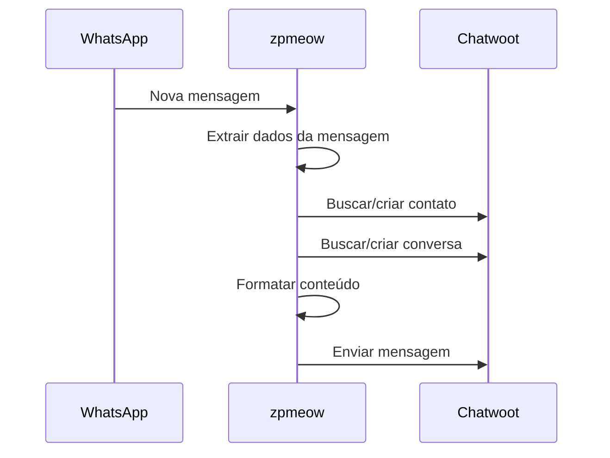
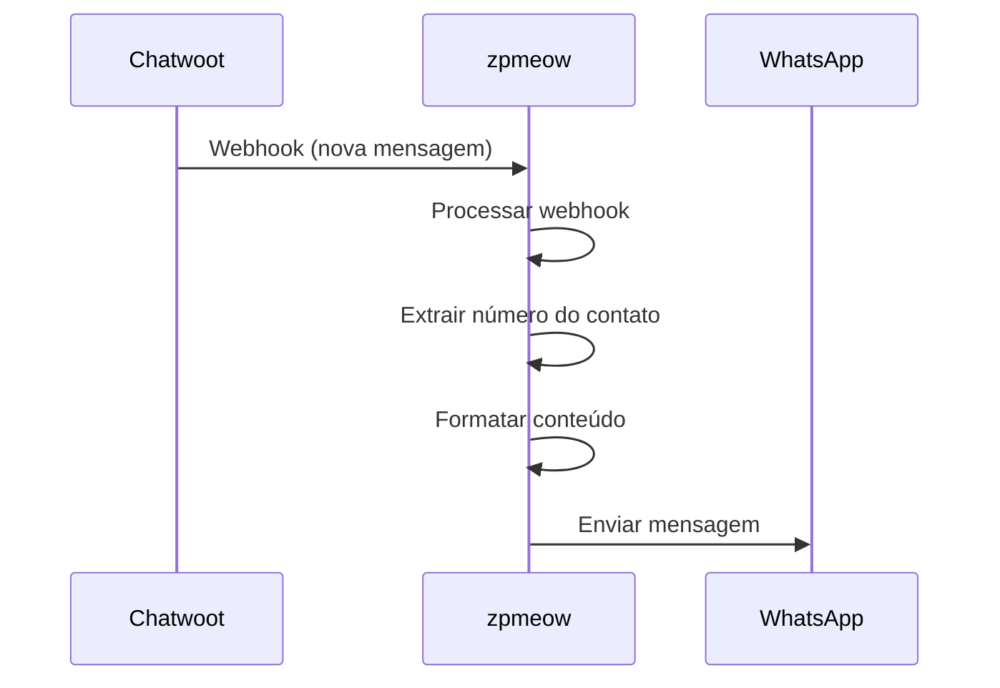

# Integração Chatwoot - zpmeow

Esta documentação descreve a implementação da integração entre zpmeow e Chatwoot, baseada na implementação da [Evolution API](https://github.com/EvolutionAPI/evolution-api).

## Arquitetura

A integração é composta pelos seguintes componentes:

```
internal/infra/chatwoot/
├── types.go          # Definições de tipos e estruturas
├── client.go         # Cliente HTTP para API do Chatwoot
├── service.go        # Lógica de negócio da integração
├── handlers.go       # Handlers HTTP para webhooks e API
├── mapper.go         # Mapeamento entre formatos WhatsApp ↔ Chatwoot
├── integration.go    # Orquestrador principal da integração
└── README.md         # Esta documentação
```

## Componentes

### 1. Types (`types.go`)

Define todas as estruturas de dados utilizadas:

- **ChatwootConfig**: Configuração da integração
- **Contact**: Representação de contatos
- **Conversation**: Representação de conversas
- **Message**: Representação de mensagens
- **Inbox**: Representação de caixas de entrada
- **WebhookPayload**: Payload dos webhooks recebidos

### 2. Client (`client.go`)

Cliente HTTP para comunicação com a API do Chatwoot:

```go
client := NewClient(baseURL, token, accountID)

// Criar contato
contact, err := client.CreateContact(ctx, ContactCreateRequest{
    InboxID:     inboxID,
    Name:        "João Silva",
    PhoneNumber: "+5511999999999",
})

// Criar conversa
conversation, err := client.CreateConversation(ctx, ConversationCreateRequest{
    ContactID: strconv.Itoa(contact.ID),
    InboxID:   strconv.Itoa(inboxID),
})

// Enviar mensagem
message, err := client.CreateMessage(ctx, conversation.ID, MessageCreateRequest{
    Content:     "Olá! Como posso ajudar?",
    MessageType: "outgoing",
})
```

### 3. Service (`service.go`)

Lógica principal da integração:

```go
service, err := NewService(config, logger)

// Processar mensagem do WhatsApp
err = service.ProcessWhatsAppMessage(ctx, whatsappMessage)

// Processar webhook do Chatwoot
err = service.ProcessWebhook(ctx, webhookPayload)
```

**Funcionalidades:**
- Encontra ou cria contatos automaticamente
- Gerencia conversas (criação, reabertura)
- Cache de contatos e conversas
- Formatação de mensagens para grupos
- Suporte a números brasileiros (9º dígito)

### 4. Handlers (`handlers.go`)

Endpoints HTTP para gerenciar a integração:

```
POST   /chatwoot/webhook/:instanceName    # Receber webhooks
POST   /chatwoot/config/:instanceName     # Criar configuração
GET    /chatwoot/config/:instanceName     # Obter configuração
PUT    /chatwoot/config/:instanceName     # Atualizar configuração
DELETE /chatwoot/config/:instanceName     # Remover configuração
```

### 5. Mapper (`mapper.go`)

Converte dados entre formatos WhatsApp e Chatwoot:

```go
mapper := NewMessageMapper(config)

// WhatsApp → Chatwoot
chatwootMsg, err := mapper.WhatsAppToChatwoot(whatsappMessage)

// Chatwoot → WhatsApp
whatsappMsg, err := mapper.ChatwootToWhatsApp(chatwootMessage)
```

**Conversões suportadas:**
- Formatação de texto (negrito, itálico, riscado)
- Mensagens de mídia (imagem, vídeo, áudio, documento)
- Localização → texto formatado
- Contatos → texto formatado
- Listas → texto formatado
- Informações de participantes em grupos

### 6. Integration (`integration.go`)

Orquestrador que gerencia múltiplas instâncias:

```go
integration := NewIntegration(logger)

// Registrar instância
err := integration.RegisterInstance("minha-instancia", config)

// Processar mensagem
err = integration.ProcessMessage(ctx, "minha-instancia", message)

// Registrar rotas HTTP
integration.RegisterRoutes(router)
```

## Fluxo de Dados

### Mensagem WhatsApp → Chatwoot



### Mensagem Chatwoot → WhatsApp



## Configuração

### Exemplo de Configuração

```go
config := &ChatwootConfig{
    Enabled:             true,
    AccountID:           "1",
    Token:              "seu-token-aqui",
    URL:                "https://app.chatwoot.com",
    NameInbox:          "WhatsApp zpmeow",
    SignMsg:            false,
    ReopenConversation: true,
    ConversationPending: false,
    MergeBrazilContacts: true,
    AutoCreate:         true,
    Organization:       "Minha Empresa",
    IgnoreJids: []string{
        "status@broadcast",
    },
}
```

### Parâmetros Importantes

- **ReopenConversation**: Reabre conversas resolvidas quando nova mensagem chega
- **ConversationPending**: Cria conversas como "pendente" em vez de "aberta"
- **MergeBrazilContacts**: Mescla contatos brasileiros com/sem 9º dígito
- **AutoCreate**: Cria inbox automaticamente se não existir
- **IgnoreJids**: Lista de JIDs para ignorar (ex: status, grupos específicos)

## Cache

O serviço utiliza cache em memória para otimizar performance:

- **Contatos**: `contact:{phoneNumber}`
- **Conversas**: `conversation:{contactID}:{inboxID}`
- **Inbox**: `{instanceName}:getInbox`

## Tratamento de Grupos

Mensagens de grupos são formatadas com informações do participante:

```
**+55 (11) 99999-9999 - João Silva:**

Olá pessoal! Como estão?
```

## Formatação de Mensagens

### WhatsApp → Chatwoot
- `*texto*` → `**texto**` (negrito)
- `_texto_` → `*texto*` (itálico)
- `~texto~` → `~~texto~~` (riscado)

### Chatwoot → WhatsApp
- `**texto**` → `*texto*` (negrito)
- `*texto*` → `_texto_` (itálico)
- `~~texto~~` → `~texto~` (riscado)

## Tipos de Mensagem

### Suportados (Recebimento)
- ✅ Texto simples e formatado
- ✅ Imagens com legenda
- ✅ Vídeos com legenda
- ✅ Áudios
- ✅ Documentos
- ✅ Stickers (convertido para texto)
- ✅ Localização (convertido para texto + link)
- ✅ Contatos (convertido para texto formatado)
- ✅ Listas (convertido para texto formatado)
- ✅ Reações
- ✅ Mensagens citadas

### Suportados (Envio)
- ✅ Texto simples e formatado
- ✅ Imagens
- ✅ Documentos
- ⚠️ Vídeos (planejado)
- ⚠️ Áudios (planejado)

## Uso

### Integração Básica

```go
package main

import (
    "context"
    "log/slog"

    "zpmeow/internal/infra/chatwoot"
    "zpmeow/internal/domain/session"
)

func main() {
    // Configuração
    config := &chatwoot.ChatwootConfig{
        Enabled:   true,
        AccountID: "1",
        Token:     "seu-token",
        URL:       "https://app.chatwoot.com",
    }
    
    // Criar serviço
    logger := slog.Default()
    service, err := chatwoot.NewService(config, logger)
    if err != nil {
        panic(err)
    }
    
    // Processar mensagem do WhatsApp
    msg := &session.Message{
        ID:       "msg123",
        From:     "5511999999999@s.whatsapp.net",
        Body:     "Olá!",
        FromMe:   false,
        PushName: "João",
    }
    
    err = service.ProcessWhatsAppMessage(context.Background(), msg)
    if err != nil {
        logger.Error("Erro", "error", err)
    }
}
```

### Integração com HTTP Server

```go
package main

import (
    "log/slog"

    "github.com/gofiber/fiber/v2"
    "zpmeow/internal/infra/chatwoot"
)

func main() {
    router := gin.Default()
    logger := slog.Default()
    
    // Criar integração
    integration := chatwoot.NewIntegration(logger)
    
    // Registrar rotas
    integration.RegisterRoutes(router)
    
    // Configurar instância
    config := &chatwoot.ChatwootConfig{
        Enabled:   true,
        AccountID: "1",
        Token:     "seu-token",
        URL:       "https://app.chatwoot.com",
    }
    
    err := integration.RegisterInstance("minha-instancia", config)
    if err != nil {
        panic(err)
    }
    
    router.Run(":8080")
}
```

## Troubleshooting

### Logs Importantes

```go
logger := slog.New(slog.NewJSONHandler(os.Stdout, &slog.HandlerOptions{
    Level: slog.LevelDebug,
}))
```

### Problemas Comuns

1. **Token inválido**: Verifique se o token tem permissões adequadas
2. **Webhook não funciona**: Confirme se a URL está acessível publicamente
3. **Contatos duplicados**: Habilite `MergeBrazilContacts` para números BR
4. **Mensagens não aparecem**: Verifique se a inbox está configurada corretamente

### Teste de Conectividade

```bash
# Testar configuração
curl -X GET http://localhost:8080/chatwoot/config/minha-instancia

# Simular webhook
curl -X POST http://localhost:8080/chatwoot/webhook/minha-instancia \
  -H "Content-Type: application/json" \
  -d '{"event":"message_created","message_type":"outgoing","content":"teste"}'
```

## Limitações Atuais

- Máximo de 1 anexo por mensagem
- Stickers convertidos para texto
- Listas/botões convertidos para texto
- Sem suporte a templates do WhatsApp Business

## Roadmap

- [ ] Suporte a múltiplos anexos
- [ ] Envio de áudios e vídeos
- [ ] Importação de histórico
- [ ] Templates do WhatsApp Business
- [ ] Métricas e monitoramento
